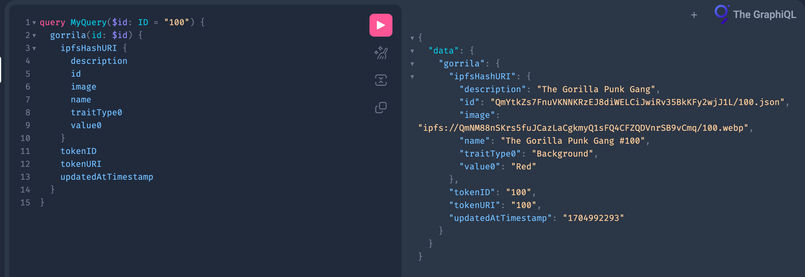

# Gorilla Punk NFT Subgraph

Muktanshu's Subgraph Assignment Submission.

## Description

This Subgraph is designed to index and query data from the Gorilla Punk NFT Collection smart contract.It allows developers to interact with the NFT collection's metadata and explore various information.

Note: Also Implemented a Primitive Subgraph Implementation for The Rebel NFT Collection ---> [Subgraph Link](https://github.com/muktanshumishra24/rebel-nft-subgraph)

## Features

- Indexes [Gorilla Punk NFT](https://opensea.io/collection/the-gorilla-punk-gang) metadata.
- Provides a GraphQL API for querying Gorilla Puk NFT data.

## Subgraph Information

### Subgraph Name

Subgraph-Assignment

### Subgraph Version

v0.2

### Subgraph Endpoint

[Link for the Subgraph](https://api.studio.thegraph.com/query/31313/subgraph-assignment/version/latest)

### Example Query 1: Retrieve All NFTs

```graphql
query gorrilaInfo {
  gorrilas {
    id
    ipfsHashURI {
      description
      id
      image
      name
      traitType0
      value0
    }
    tokenID
    updatedAtTimestamp
    tokenURI
  }
}
```


### Example Query 2: Retrieve NFT by ID

```graphql
query MyQuery($id: ID = "100") {
  gorrila(id: $id) {
    ipfsHashURI {
      description
      id
      image
      name
      traitType0
      value0
    }
    tokenID
    tokenURI
    updatedAtTimestamp
  }
}
```



## NFT Collection Information

### NFT Contract Address

0x7A79644bdcc87bCB8312a9F3814c9E949aae4C70

### NFT Metadata


## Subgraph Dashboard


